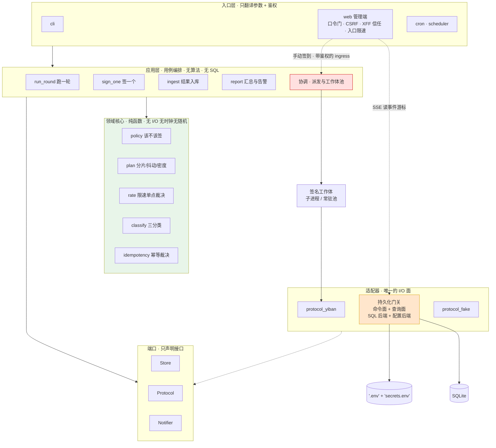
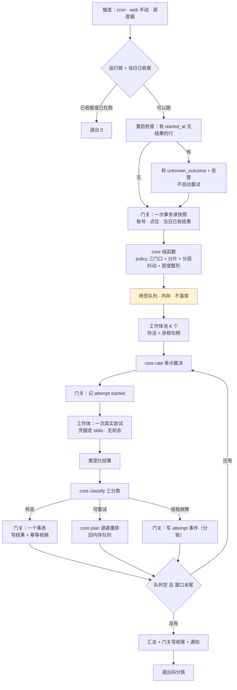
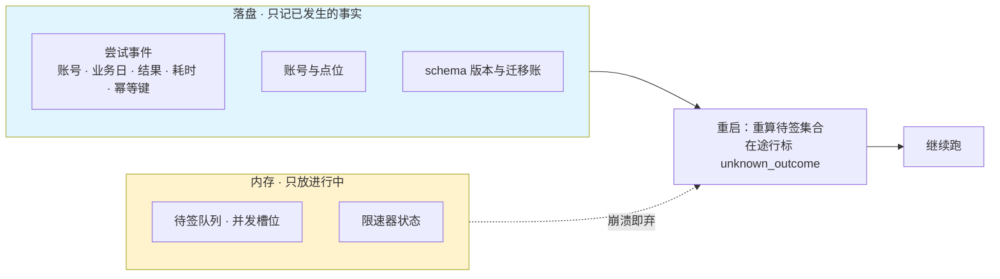
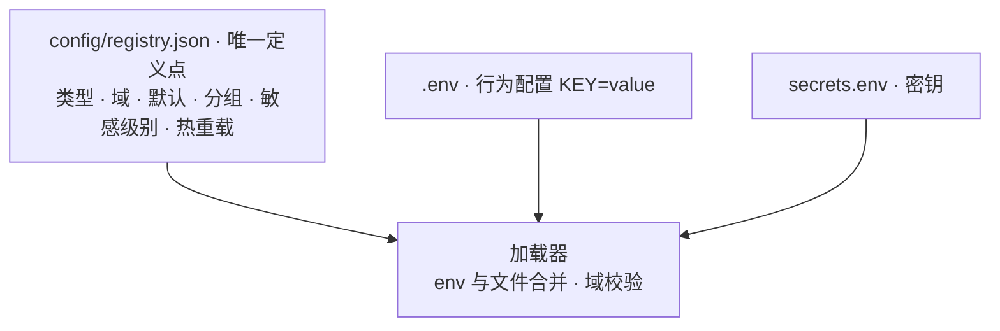

# 目标架构：分层与依赖方向（契约）

> **性质**：设计契约，不是建议。它是分层重构（简化批）的任务书依据。
> **脱敏口径**：本文只含契约部分。不含内部工单号、缺陷计数、主机与账号信息，也不含审查过程记录——那些属内部工作文稿，仅本地留存。
> **仲裁**：**以代码为准**。本文与代码不符时以代码为准，并在该批交付时刷新本文。

## 1. 分层与依赖方向



**依赖方向单向**：`entry → app → core`；`adapters` 实现 `ports`。web 只调 `app/`，不 import 持久化实现。

**三条层内红线**：

- `core`：无 I/O、无时钟、无随机——同一输入必得同一输出，可不用 mock 测。
- `app`：无 SQL；事务边界在这一层。
- `entry`：只翻译参数与鉴权，不含业务判据。

## 2. 层准入判据

| 层 | 准入判据 |
|---|---|
| `core` | 是纯函数吗；同一输入必得同一输出吗；能不用 mock 测吗 |
| `app` | 是「一次业务动作」吗；事务边界在这里吗 |
| `adapters` | 是唯一碰外部世界的地方吗 |
| `entry` | 只做参数翻译与鉴权吗 |

## 3. 目标目录树

```text
yiban/
├── entry/                 # 入口层：只翻译参数 + 鉴权
│   ├── cli/               #   七子命令（现 yiban/cli.py）
│   └── （web 管理端独立于本包；docker/scheduler 为容器接线）
├── app/                   # 应用层：用例编排，无算法无 SQL
│   ├── round.py           #   run_round 跑一轮（现 engine/round）
│   ├── sign_one.py        #   sign_one（现 executor_v3 主流程）
│   ├── ingest.py          #   结果入库（现 executor_v3 落库段）
│   ├── report.py          #   汇总与告警（现 alerts）
│   └── coord.py           #   派发与工作体池（现 workers）
├── core/                  # 领域核心：纯函数，无 I/O 无时钟无随机
│   ├── policy.py          #   该不该签（现 attempts/window 判定）
│   ├── plan.py            #   分片/抖动/密度（现 planner）
│   ├── rate.py            #   限速单点（现 token_bucket）
│   ├── classify.py        #   三分类（现 attempts 关键词表）
│   ├── idempotency.py     #   幂等裁决
│   ├── masking.py         #   脱敏（现 yiban/masking，纯函数）
│   └── security_policy.py #   WAF 词表与白名单裁决（现 yiban/security）
├── ports/                 # 端口：只声明接口
│   ├── store.py           #   持久化契约
│   ├── protocol.py        #   协议契约
│   └── notifier.py        #   通知契约
├── adapters/              # 适配器：唯一 I/O 面
│   ├── persistence/       #   门关：命令面 + 查询面
│   │   ├── migrations/    #     迁移账（含方言差异）
│   │   └── audit.py       #     哈希链审计
│   ├── config/            #   env_io + 配置名册加载器 + secrets
│   ├── protocol_yiban/    #   现 yiban/protocol
│   ├── protocol_fake/     #   测试假服务器
│   └── statefiles/        #   状态文件 I/O（现 state_io）
└── workers/               # 签名工作体（slim；进程模型由测量决定）
web/                       # HTTP 适配（独立包；routes 只翻译 + 鉴权）
frontend/                  # Vue（独立构建）
```

### 每模块的演进映射

| 现在的位置 | 目标层 | 处置 |
|---|---|---|
| `engine/planner.py` `schedule.py` `window.py` `token_bucket.py` `hrw.py` | `core/` | 移动（纯函数，改 import） |
| `engine/attempts.py` | `core/classify.py` + `core/policy.py` | 拆分移动 |
| `yiban/masking.py` `yiban/security.py` | `core/` | 移动 |
| `engine/round.py` `alerts.py` | `app/` | 移动 |
| `engine/runner.py` | `app/` | 移动 |
| `engine/probe.py` | `app/`（探针＝一类用例） | 移动 |
| `engine/workers.py` | `workers/` | 移动 |
| `engine/executor_v3.py` | `app/sign_one` + `app/coord` + `workers/` | 拆分（切面评估后进行） |
| `engine/state_io.py` | `adapters/statefiles/` | 移动（I/O 面） |
| `store/*`（除 migrations/audit） | `adapters/persistence/` | 移动 |
| `store/migrations.py` | `adapters/persistence/migrations/` | 移动 |
| `store/audit_chain.py` | `adapters/persistence/audit.py` | 移动 |
| `mail/` `notify/` | `adapters/notifier/` | 移动 |
| `yiban/infra/`（env_io 等） | `adapters/config/` | 移动（＋名册加载器） |
| `yiban/cli.py` | `entry/cli/` | 移动；收掉对存储层的直接引用 |
| `web/app.py` 再导出表 | 打桩面迁移完成后删除 | 拆解（与测试定型同批） |
| `web/routes/` `services/` | `entry`（HTTP）／`app`（用例） | 归层 |
| `docker/scheduler.py` | 容器入口 | 保持 |
| `frontend/` | 独立构建 | 保持 |

**不过关的候选保持不动**——不为目录好看强拆。

## 4. 运行时流程（目标）



**崩溃语义（必须钉死）**：

1. 每次真实尝试之前，先记一行「尝试已开始（带 `started_at`）」。
2. 协调者启动时检查「有 `started_at`、无结果」的行：标 `unknown_outcome`、响亮告警、**不自动重试**。
3. 判据：**漏签可接受，双登录不可接受**。在途集合只有 K 条（K ＝ 并发工作体数），崩溃影响面有界。

## 5. 持久化边界（目标）



## 6. 配置与密钥分层（目标）



三层职责：**名册**（`config/registry.json`）是默认值与合法域的唯一来源；**`.env`** 只放行为配置；**`secrets.env`** 只放密钥。迁移期密钥双写一个版本周期，加载器读 `secrets.env` 优先。

## 7. 施工判据

1. **拆分六判据**：独立领域／分别修改／可独立测／不同依赖／公共容器／牵连无关——**不过关保持不动**。
2. **执行前十问**：其中「能否更小改动」为可是即选小。
3. **单向依赖铁律**：`entry → app → core`；`adapters` 实现 `ports`；web 不 import 持久化实现。
4. **行为保持**：每步「读断言 → 移动 → 全量跑测 → diff 检查」；发现无关缺陷不顺手修。
5. **打桩面迁移与拆分同一批**：不许「先拆后改测试」；分层重构必须与测试定型同批。
